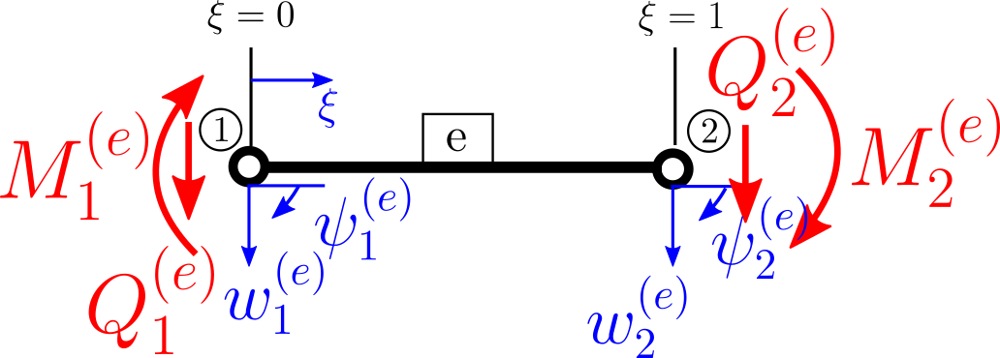

---
jupytext:
  formats: md:myst,ipynb
  text_representation:
    extension: .md
    format_name: myst
    format_version: 0.13
    jupytext_version: 1.16.7
kernelspec:
  display_name: Python 3 (ipykernel)
  language: python
  name: python3
---

+++ {"editable": true, "slideshow": {"slide_type": "slide"}}

# Balken FEM mit Python

In diesem Notebook wird die Lösung eines Balkenproblems mit der Methode der finiten Elemente (FEM) in Python implementiert. Die Lösung wird mit der analytischen Lösung verglichen und die Konvergenz der FEM-Lösung wird untersucht.

<div style="text-align: center;width: 400px;">
    
</div>

_Kinematik der Balkendeformation nach: Gross, D., Hauger, W., Schröder, J., & Wall, W. A. (2007). Technische Mechanik:
Band 2: Elastostatik. Springer._


Die Differentialgleichung für die Durchbiegung $w$ eines Balkens mit konstanter Biegesteifigkeit $EI$ lautet:

$$
EI w^{IV} = q_0
$$

Die schwache Form der Differentialgleichung wurde in der Vorlesung besprochen und lautet:

$$
 EI_y \int_L \delta w'' w'' \text{ dx} - \int_L q(x) \delta w \text{ dx} - F_I \delta w_I - M_J \delta w'_J = 0 \; .
$$

Hierbei stellen $F_I$ und $M_I$ die an den Knoten angreifenden Einzellasten und Momente dar

+++ {"editable": true, "slideshow": {"slide_type": "slide"}}

.

Das Balkenelement hat folgende interne Freiheitsgrade und angreifende Lasten:

<div style="text-align: center;width: 400px;">
    
</div>

Ziel ist es, die schwache Form der Differentialgleichung in ein algebraisches Gleichungssystem umzuwandeln:

$$
\boldsymbol{K} \boldsymbol{w} = \boldsymbol{F}_Q + \boldsymbol{F} + \boldsymbol{M}
$$

Hierbei hat der Vektor $\boldsymbol{F}$ der äußeren angreifenden Lasten nur Einträge an den Stellen, die mit den Durchbiegungen verknüpft sind. Der Vektor $\boldsymbol{M}$ hat hingegen nur Einträge an den Stellen, die mit den Neigungen verknüpft sind.

+++ {"editable": false, "slideshow": {"slide_type": "slide"}}

## Verschiebungsansatz

Analog zum Stabelement führen wir die normierte Koordinate $\xi=\frac{x}{\ell_e}$ ein. Die Ansatzfunktionen für die Durchbiegung $w_h$ wird dann als Linearkombination der Formfunktionen $N_I$ und der Freiheitsgrade $\hat{w}_I$ geschrieben: 
$$
w_h = \sum_{I=1}^{6} N_I \hat{w}_I
$$

Als Formfunktionen $N_I$ werden die Hermite-Polynome verwendet. Diese lauten:

$$
\begin{align}
  N_1 &= 1-3\xi^2+2\xi^3 \\ 
  N_2 &= (\xi-2\xi^2+\xi^3)\ell_e \\ 
  N_3 &= 3\xi^2-2\xi^3 \\ 
  N_4 &= (-\xi^2+\xi^3)\ell_e
\end{align}
$$

```{code-cell} ipython3
---
editable: true
slideshow:
  slide_type: subslide
tags: ['remove_input ']
---
import numpy as np
import plotly.graph_objects as go

# Define the x values
x = np.linspace(0, 1, 100)

# Define the shape functions - Hermite polynomials 4th order
N1 = 1 - 3*x**2 + 2*x**3
N2 = x - 2*x**2 + x**3
N3 = 3*x**2 - 2*x**3
N4 = -x**2 + x**3

# Create the figure
fig = go.Figure()

# Add traces for each shape function
fig.add_trace(go.Scatter(x=x, y=N1, mode='lines', name='N_1'))
fig.add_trace(go.Scatter(x=x, y=N2, mode='lines', name='N_2'))
fig.add_trace(go.Scatter(x=x, y=N3, mode='lines', name='N_3'))
fig.add_trace(go.Scatter(x=x, y=N4, mode='lines', name='N_4'))
fig.update_layout(
    xaxis_title=r"$\xi$",
    yaxis_title=r'$N(\xi)$',
    legend=dict(x=1.05, y=1),
    font=dict(family="Serif", size=15),
    template='plotly_white',
    xaxis=dict(showgrid=True, gridcolor='grey', gridwidth=0.6, griddash='dash'),
    yaxis=dict(showgrid=True, gridcolor='grey', gridwidth=0.6, griddash='dash')
)
```

+++ {"editable": true, "slideshow": {"slide_type": "slide"}}

## Element-Steifigkeitsmatrix für ein Balkenelemt

Die Formfunktionen sind bzgl. der lokalen Koordinate $\xi$ definiert. In der schwachen Formulierung wird die Ableitung der Formfunktionen bzgl. der globalen Koordinate $x$ benötigt. Die Ableitung der Formfunktionen bzgl. der globalen Koordinate $x$ ist gegeben durch:
$$
 \frac{\text{d} \xi}{\text{d} x} = \frac{1}{\ell_e} \qquad \rightarrow \qquad \text{d} x= \ell_e \text{d} \xi
$$

Wenn wir uns nun den ersten Term der schwachen Form herausgreifen und die Ableitungen bilden lauten diese:

$$
\begin{align*}
 EI_y \int_L \delta w'' w'' \text{ dx}  & = EI_y \int_0^1   \frac{\text{d}^2 N_I}{\text{dx dx}} \delta \hat{w}_I \frac{\text{d}^2 N_J}{\text{dx dx}} \hat{w}_J \ell_e \text{ d} \xi  \\
 & = \delta \hat{w}_I \frac{EI_y}{\ell_e^3} \int_0^1   N_I''N_J''    \text{ d} \xi \hat{w}_J \\
 & =\delta \hat{w}_I \boldsymbol{K}_{IJ} \hat{w}_J
\end{align*}
$$

Die Steifigkeitsmatrix $\boldsymbol{K}_{IJ}$ wollen wir jetzt interaktiv berechnen.

+++ {"editable": true, "slideshow": {"slide_type": "slide"}}

### Definition der Formfunktionen

```{code-cell} ipython3
---
editable: true
slideshow:
  slide_type: ''
---
import sympy as sp

# Define the variables
xi,ell = sp.symbols('xi, ell')

# Define the Hermite polynomials
N1 = 1 - 3*xi**2 + 2*xi**3
N2 = (xi - 2*xi**2 + xi**3)*ell
N3 = 3*xi**2 - 2*xi**3
N4 = (-xi**2 + xi**3)*ell

N = sp.Matrix([[N1], [N2], [N3], [N4]])
N
```

+++ {"editable": true, "slideshow": {"slide_type": "slide"}}

### Berechnung der Ableitungen

Siehe schwache Form:
$$
\begin{align*}
 EI_y \int_L \delta w'' w'' \text{ dx}  & = EI_y \int_0^1   \frac{\text{d}^2 N_I}{\text{dx dx}} \delta \hat{w}_I \frac{\text{d}^2 N_J}{\text{dx dx}} \hat{w}_J \ell_e \text{ d} \xi  \\
 & = \delta \hat{w}_I \frac{EI_y}{\ell_e^3} \int_0^1   \textcolor{red}{N_I''N_J''}    \text{ d} \xi \hat{w}_J \\
 & =\delta \hat{w}_I \boldsymbol{K}_{IJ} \hat{w}_J
\end{align*}
$$

```{code-cell} ipython3
---
editable: true
slideshow:
  slide_type: ''
---
dNdxidxi = sp.diff(N,xi,2)
dNdxidxi
```

```{code-cell} ipython3
---
editable: true
slideshow:
  slide_type: ''
---
dNdxidxidxi = sp.diff(N,xi,3)
dNdxidxidxi
```

+++ {"editable": true, "slideshow": {"slide_type": "slide"}}

### Bildung des Integranten

Siehe schwache Form:
$$
\begin{align*}
 EI_y \int_L \delta w'' w'' \text{ dx}  & = EI_y \int_0^1   \frac{\text{d}^2 N_I}{\text{dx dx}} \delta \hat{w}_I \frac{\text{d}^2 N_J}{\text{dx dx}} \hat{w}_J \ell_e \text{ d} \xi  \\
 & = \delta \hat{w}_I \frac{EI_y}{\ell_e^3} \int_0^1 \textcolor{red}   {N_I''N_J''    }\text{ d} \xi \hat{w}_J \\
 & =\delta \hat{w}_I \boldsymbol{K}_{IJ} \hat{w}_J
\end{align*}
$$

```{code-cell} ipython3
---
editable: true
slideshow:
  slide_type: ''
---
integrant = dNdxidxi*dNdxidxi.T
integrant
```

+++ {"editable": true, "slideshow": {"slide_type": "slide"}}

### Integration

Siehe schwache Form:
$$
\begin{align*}
 EI_y \int_L \delta w'' w'' \text{ dx}  & = EI_y \int_0^1   \frac{\text{d}^2 N_I}{\text{dx dx}} \delta \hat{w}_I \frac{\text{d}^2 N_J}{\text{dx dx}} \hat{w}_J \ell_e \text{ d} \xi  \\
 & = \delta \hat{w}_I \textcolor{red}   {\frac{EI_y}{\ell_e^3} \int_0^1 N_I''N_J''    \text{ d} \xi} \hat{w}_J \\
 & =\delta \hat{w}_I \boldsymbol{K}_{IJ} \hat{w}_J
\end{align*}
$$

```{code-cell} ipython3
---
editable: true
slideshow:
  slide_type: ''
---
EI = sp.symbols('EI')
Kmat = EI/ell**3 * sp.integrate(integrant,(xi,0,1))
Kmat
```

+++ {"editable": true, "slideshow": {"slide_type": "slide"}}

## Berechnung der Streckenlast - zweiter Term der schwachen Form

Die Streckenlast $q(x)$ hat im Element $e$ im Allgemeinen einen beliebigen Verlauf. Um die Streckenlast zu diskretisieren wird angenommen, dass die Streckenlast im Element linear veränderlich ist. Es wird also der folgende Ansatz gemacht:

$$
q_h(\xi)  = (1-\xi) \hat{q}_1 + \xi \hat{q}_2 = \begin{pmatrix} 1-\xi & \xi \end{pmatrix} \begin{pmatrix} \hat{q}_1 \\ \hat{q}_2 \end{pmatrix} 
$$

Dies wird jetzt in die schwache Form eingesetzt:

$$
\begin{align*}
\int_L  \delta w q(x) \text{ dx} & = \int_L N_I(\xi) \delta \hat{w}_I q_h(\xi) \text{ dx} \\
& = \delta \hat{w}_I \, \int_0^1 \begin{pmatrix}
 N_1 \\
 N_2\\
 N_3 \\ 
 N_4  \end{pmatrix}  \begin{pmatrix} 1-\xi & \xi \end{pmatrix} \begin{pmatrix} \hat{q}_1 \\ \hat{q}_2 \end{pmatrix}  \ell_e \text{ d} \xi \\
 & = \delta \hat{w}_I \boldsymbol{F}_Q \\
\end{align*} 
$$

Den Vektor der Streckenlasten $\boldsymbol{F}_Q$ berechnen wir nun interaktiv.

+++ {"editable": true, "slideshow": {"slide_type": "slide"}}

### Ansatz für die Streckenlast

```{code-cell} ipython3
q1,q2 = sp.symbols('q1 q2')
qh = sp.Matrix([q1,q2])
Nq1 = 1-xi
Nq2 = xi
Nq = sp.Matrix([Nq1, Nq2]).T
Nq*qh
```

+++ {"editable": true, "slideshow": {"slide_type": "slide"}}

### Bildung des Integranten

$$
\begin{align*}
\int_L  \delta w q(x) \text{ dx} & = \int_L N_I(\xi) \delta \hat{w}_I q_h(\xi) \text{ dx} \\
& = \delta \hat{w}_I \, \int_0^1 \textcolor{red}{\begin{pmatrix}
 N_1 \\
 N_2\\
 N_3 \\ 
 N_4  \end{pmatrix}  \begin{pmatrix} 1-\xi & \xi \end{pmatrix} \begin{pmatrix} \hat{q}_1 \\ \hat{q}_2 \end{pmatrix}  \ell_e }\text{ d} \xi \\
 & = \delta \hat{w}_I \boldsymbol{F}_Q \\
\end{align*} 
$$

```{code-cell} ipython3
---
editable: true
slideshow:
  slide_type: ''
---
integrantq = N*Nq*qh*ell
integrantq
```

+++ {"editable": true, "slideshow": {"slide_type": "slide"}}

### Integrieren der Funktion

$$
\begin{align*}
\int_L  \delta w q(x) \text{ dx} & = \int_L N_I(\xi) \delta \hat{w}_I q_h(\xi) \text{ dx} \\
& = \delta \hat{w}_I \, \textcolor{red}{\int_0^1 \begin{pmatrix}
 N_1 \\
 N_2\\
 N_3 \\ 
 N_4  \end{pmatrix}  \begin{pmatrix} 1-\xi & \xi \end{pmatrix} \begin{pmatrix} \hat{q}_1 \\ \hat{q}_2 \end{pmatrix}  \ell_e \text{ d} \xi} \\
 & = \delta \hat{w}_I \boldsymbol{F}_Q \\
\end{align*} 
$$

```{code-cell} ipython3
---
editable: true
slideshow:
  slide_type: ''
---
FQ = sp.integrate(integrantq,(xi,0,1))
sp.simplify(FQ)
```

+++ {"editable": true, "slideshow": {"slide_type": "slide"}}

# Beispiel

<div style="text-align: center;width: 400px;">
    
</div>


Für das dargestellte Beispiel eines statisch bestimmten Balkens mit konstanter Streckenlast lässt sich die Lösung der Verschiebung durch vierfache Integration der Differentialgleichung bestimmen. Die Lösung lautet:

$$
EI w(x) =\frac{\ell^{3} q_{0} x}{24} - \frac{\ell q_{0} x^{3}}{12} + \frac{q_{0} x^{4}}{24}
$$

Auch die Schnittgrößen können analytisch einfach bestimmt werden:

$$
\begin{align*}
EI w'' & =-M(x) =  \frac{q_{0} x \left(\ell - x\right)}{2} \\
EI w'''' &= -Q(x) = q_{0} \left(\frac{\ell}{2} - x\right)
\end{align*}
$$

```{code-cell} ipython3
---
editable: true
slideshow:
  slide_type: slide
---
import sympy as sp
from sympy import Rational
from sympy import Eq
from sympy.plotting import plot, PlotGrid


x,EI,ell,q0,C_1,C_2,C_3,C_4 = sp.symbols('x,EI,ell,q0,C_1,C_2,C_3,C_4')

# Biegelinie
w = 1/EI*(Rational(1,24)*q0*x**4 +Rational(1,6)*C_1*x**3+Rational(1,2)*C_2*x**2+C_3*x+C_4)

# Bestimmung der Integrationskonstanten
eq1 = Eq(w.subs(x,0),0)
eq2 = Eq(w.subs(x,ell),0)
eq3 = Eq(-w.diff(x,2).subs(x,0),0)
eq4 = Eq(-w.diff(x,2).subs(x,ell),0)
solution = sp.solve((eq1,eq2,eq3,eq4),(C_1,C_2,C_3,C_4))
wfun = w.subs(solution)
Mfun = -wfun.diff(x,2)
Qfun = -wfun.diff(x,3)

# Plot der Biegelinie und Schnittgrößen
wp = w.subs(solution).subs({"ell":1,"q0":1,"EI":1})
M = -wp.diff(x,2)
Q = -wp.diff(x,3)

p1= plot(wp,(x,0,1),title=r'Durchbiegung $\frac{EI}{q_0} w$',show=False,xlabel=r'$\frac{x}{\ell}$',ylabel=r'$\frac{EI}{q_0} w$',line_color='black')
p2= plot(M,(x,0,1),title=r'Biegemoment $\frac{1}{q_0} M$',show=False,xlabel=r'$\frac{x}{\ell}$',ylabel=r'$\frac{1}{q_0}M$',line_color='red')
p3= plot(Q,(x,0,1),title=r'Querkraft $\frac{1}{q_0}Q$',show=False,xlabel=r'$\frac{x}{\ell}$',ylabel=r'$\frac{1}{q_0}Q$',line_color='blue')


PlotGrid(1,3,p1,p2,p3,size=(15,5));
```

+++ {"editable": true, "slideshow": {"slide_type": "slide"}}

## Lösung mit der FEM

```{code-cell} ipython3
from IPython.display import display, Markdown

# Open the Python file and read its content
with open('BalkenFEM.py', 'r') as file:
    content = file.read()

# Display the content as Markdown
display(Markdown(f'```python\n{content}\n```'))
```

+++ {"editable": true, "slideshow": {"slide_type": "slide"}}

## Set Up Problem

```{code-cell} ipython3
---
editable: true
slideshow:
  slide_type: ''
---
from BalkenFEM import BalkenFEM
import numpy as np
import sympy as sp

numnp = 3 # Anzahl der Knoten im System
numel = numnp -1 # Anzahl der Elemente im System
ell = 8000 # Länge des Balkens in mm

# Erzeugen des FE-Objektes
Lastfall = BalkenFEM(numnp=numnp,numel=numel)

# Definiere die Koordinaten der beiden Randknoten
X1 = np.array([0.0,0.0]) #mm
X2 = np.array([ell,0.0]) #mm


# Generate interpolation points
t = np.linspace(0, 1, numnp)
X = X1 + t[:, np.newaxis] * (X2 - X1)
# print(f"Coordinates of the nodes: \n{X}") 

Lastfall.setNodalCoords(X)

# Generate Elements
IX = np.column_stack((np.arange(0, numnp-1), np.arange(1, numnp)))
# print(f"Connectivity table: \n{IX}")

Lastfall.setElements(IX)

# Material properties and cross section
Emod = 210000 # MPa
sma = 77.67*10**4 # mm^4
Ilist = [sma for i in range(numel)]
Elist = [Emod for i in range(numel)]

Lastfall.setElementData(Elist, Ilist)
```

+++ {"editable": true, "slideshow": {"slide_type": "slide"}}

## Definiere Randbedingungen

```{code-cell} ipython3
---
editable: true
slideshow:
  slide_type: ''
---
# Dirichlet Randbedingungen (Verschiebung)
dnodes = [0, numnp-1]
ddir = [0,0]
dval = [0,0]


Lastfall.setDirichletBoundaryCondition(dnodes,ddir,dval)

# Neumann Randbedingungen (Kraft)
fnodes = [i for i in range(numnp)] # forces
mnodes = [i for i in range(numnp)] # moments
fdir1 = [0 for i in range(numnp)] 
mdir2 = [1 for i in range(numnp)] 
fval1 = [0 for i in range(numnp)]
mval2 = [0 for i in range(numnp)]
q0 = -10 # N/mm
# fval1[2] = q0*ell

Lastfall.setExternalForces(fnodes+mnodes,fdir1+mdir2,fval1+mval2)

# Verteilte Lasten

q=q0*np.ones((numnp,1))
Lastfall.setDistributedLoads(q)
```

+++ {"editable": true, "slideshow": {"slide_type": "slide"}}

## Plot Problem

```{code-cell} ipython3
---
editable: true
slideshow:
  slide_type: ''
---
import matplotlib.pyplot as plt
wanalytisch = sp.lambdify(x,wfun.subs({"EI":Emod*sma,"q0":q0,"ell":ell}),"numpy")


def plotBalken(X,q,fval1,u=None):
    fix,ax = plt.subplots(figsize=(10,5))
    if u is not None:
        ax.plot(X[:,0],X[:,1]+u,c='b')
        xline = np.linspace(0,ell,100)
        ax.plot(xline,wanalytisch(xline),'b--')
        ax.legend(["w - FEM","w - analytisch"])
    ax.scatter(X[:,0],X[:,1],c='k',s=100)
    ax.plot(X[:,0],X[:,1],c='k')
    ax.quiver(X[:,0], X[:,1],  [0 for i in range(numnp)],q,color='red')
    ax.quiver(X[:,0], X[:,1],  [0 for i in range(numnp)],fval1,color='red')
    ax.set_xlabel('x [mm]')
    ax.set_ylabel('w [mm]')
    ax.set_title('Balken')
    ax.grid(True)
    
    plt.axis('equal')
    plt.show()

plotBalken(X,q,fval1)
```

+++ {"editable": true, "slideshow": {"slide_type": "slide"}}

## Solve Problem

```{code-cell} ipython3
---
editable: true
slideshow:
  slide_type: ''
---
Lastfall.assembleGlobalMatrix2D()
Lastfall.solveSystem()
```

```{code-cell} ipython3
---
editable: true
slideshow:
  slide_type: ''
---
plotBalken(X,q,fval1,Lastfall.dof[:,0])
```

```{code-cell} ipython3
---
editable: true
slideshow:
  slide_type: ''
---
wa = wanalytisch(4000)
wFEM = Lastfall.getDeflection(4000)
error = (wa-wFEM)/wa*100

print(f"Durchbiegung analytisch: {wa}")
print(f"Durchbiegung FEM: {wFEM}")
print(f"Fehler: {error}%")
```

+++ {"editable": true, "slideshow": {"slide_type": "subslide"}}

### Bestimmung der Schnittlasten

+++ {"editable": true, "slideshow": {"slide_type": "subslide"}}

### Schnittmoment

```{code-cell} ipython3
---
editable: true
slideshow:
  slide_type: ''
---
xm,M = Lastfall.computeMoment(n=10)
Manalytisch  = sp.lambdify(x,Mfun.subs({"EI":Emod*sma,"q0":q0,"ell":ell}),"numpy")


def plotMoment(x,M):
    fix,ax = plt.subplots(figsize=(10,5))
    ax.plot(x,M,'r')
    ax.plot(x,Manalytisch(x),'r--')
    ax.legend(["M - FEM","M - analytisch"])
    ax.grid(True)


plotMoment(xm,M)
```

```{code-cell} ipython3
---
editable: true
slideshow:
  slide_type: ''
---
Ma = Manalytisch(4000)
MFEM = np.min(M)
error = (Ma-MFEM)/Ma*100

print(f"Biegemoment analytisch: {Ma}")
print(f"Biegemoment FEM: {MFEM}")
print(f"Fehler: {error}%")
```

+++ {"editable": true, "slideshow": {"slide_type": "subslide"}}

### Schnittgröße: Querkraft

```{code-cell} ipython3
---
editable: true
slideshow:
  slide_type: ''
---
xm,Q = Lastfall.computeQuerkraft(n=10)
Qanalytisch  = sp.lambdify(x,Qfun.subs({"EI":Emod*sma,"q0":q0,"ell":ell}),"numpy")


def plotQuerkraft(x,Q):
    fix,ax = plt.subplots(figsize=(10,5))
    ax.plot(x,Q,'b')
    ax.plot(x,Qanalytisch(x),'b--')
    ax.legend(["Q - FEM","Q - analytisch"])
    ax.grid(True)
    
plotQuerkraft(xm,Q)
```

```{code-cell} ipython3
---
editable: true
slideshow:
  slide_type: ''
---
Qa = Qanalytisch(0)
QFEM = np.min(Q)
error = (Qa-QFEM)/Qa*100

print(f"Querkraft analytisch: {Qa}")
print(f"Querkraft FEM: {QFEM}")
print(f"Fehler: {error}%")
```

+++ {"editable": true, "slideshow": {"slide_type": "slide"}}

## Konvergenzstudie

```{code-cell} ipython3
---
editable: true
slideshow:
  slide_type: ''
---
def setUpProblem(numnp):
    numel = numnp -1
    ell = 8000

    Lastfall = BalkenFEM(numnp=numnp,numel=numel)

    X1 = np.array([0.0,0.0])     #mm
    X2 = np.array([ell,0.0]) #mm


    # Generate interpolation points
    t = np.linspace(0, 1, numnp)
    X = X1 + t[:, np.newaxis] * (X2 - X1)
    # print(f"Coordinates of the nodes: \n{X}") 

    Lastfall.setNodalCoords(X)

    # Generate Elements
    IX = np.column_stack((np.arange(0, numnp-1), np.arange(1, numnp)))
    # print(f"Connectivity table: \n{IX}")

    Lastfall.setElements(IX)

    # Material properties and cross section
    Emod = 210000 # MPa
    sma = 77.67*10**4 # mm^4
    Ilist = [sma for i in range(numel)]
    Elist = [Emod for i in range(numel)]

    Lastfall.setElementData(Elist, Ilist)

    # Dirichlet Randbedingungen (Verschiebung)
    dnodes = [0, numnp-1]
    ddir = [0,0]
    dval = [0,0]


    
    Lastfall.setDirichletBoundaryCondition(dnodes,ddir,dval)

    # Neumann Randbedingungen (Kraft)
    fnodes = [i for i in range(numnp)] # forces
    mnodes = [i for i in range(numnp)] # moments
    fdir1 = [0 for i in range(numnp)] 
    mdir2 = [1 for i in range(numnp)] 
    fval1 = [0 for i in range(numnp)]
    mval2 = [0 for i in range(numnp)]
    q0 = -10 # N/mm
    # fval1[2] = q0*ell

    Lastfall.setExternalForces(fnodes+mnodes,fdir1+mdir2,fval1+mval2)

    # Verteilte Lasten

    q=q0*np.ones((numnp,1))
    Lastfall.setDistributedLoads(q)


    Lastfall.assembleGlobalMatrix2D()
    Lastfall.solveSystem()

    xm,Q = Lastfall.computeQuerkraft(n=3)
    xm,M = Lastfall.computeMoment(n=3)


    return np.min(Q),np.min(M),Lastfall
```

```{code-cell} ipython3
---
editable: true
slideshow:
  slide_type: subslide
---
npoints =  np.linspace(2,202,51)

QFEM = np.zeros((51,))
MFEM = np.zeros((51,))
ErrorM= np.zeros((51,))
ErrorQ= np.zeros((51,))

for i,p in enumerate(npoints):
    
    QQ,MM,LC=setUpProblem(int(p))
    QFEM[i]=QQ
    MFEM[i]=MM
    ErrorQ[i] = (Qa-QFEM[i])/Qa*100
    ErrorM[i] = (Ma-MFEM[i])/Ma*100
```

```{code-cell} ipython3
---
editable: true
slideshow:
  slide_type: ''
---
import pandas as pd

df = pd.DataFrame({"M":MFEM,"error M":ErrorM,"Q":QFEM,"error Q":ErrorQ},index=npoints)

df
```

```{code-cell} ipython3
---
editable: true
slideshow:
  slide_type: subslide
---
fig, ax = plt.subplots(1,2,figsize=(12,5))
ax[0].plot(df.index,df["M"])
ax[0].set_title("Konvergenz Schnittmoment")
ax[0].set_xlabel("Anzahl Knoten")
ax[0].set_ylabel("M")
ax[0].grid(True)
ax[1].plot(df.index,df["Q"])
ax[1].set_title("Konvergenz SchnittKraft Q")
ax[1].set_xlabel("Anzahl Knoten")
ax[1].set_ylabel("Q")
ax[1].grid(True)
```

```{code-cell} ipython3
---
editable: true
slideshow:
  slide_type: subslide
---
fig, ax = plt.subplots(1,2,figsize=(12,5))
ax[0].plot(df.index,df["error M"])
ax[0].set_title("Konvergenz Fehler des Schnittmoments")
ax[0].set_xlabel("Anzahl Knoten")
ax[0].set_ylabel("error M")
ax[0].set_yscale("log")  # Set y-axis to logarithmic scale
ax[0].set_xscale("log")  # Set x-axis to logarithmic scale
ax[0].grid(True)
ax[1].plot(df.index,df["error Q"])
ax[1].set_title("Konvergenz Fehler SchnittKraft Q")
ax[1].set_xlabel("Anzahl Knoten")
ax[1].set_ylabel("error Q")
ax[1].set_yscale("log")  # Set y-axis to logarithmic scale
ax[1].set_xscale("log")  # Set x-axis to logarithmic scale
ax[1].grid(True)
```

+++ {"editable": true, "slideshow": {"slide_type": "slide"}}

## Analyse der Steifigkeitsmatrix

```{code-cell} ipython3
---
editable: true
slideshow:
  slide_type: ''
---
matrix = LC.Kges
plt.figure(figsize=(6, 6))
plt.spy(matrix, markersize=10)  # You can adjust the markersize as needed
plt.title('Sparsity Pattern of the Matrix')
plt.xlabel('Column Index')
plt.ylabel('Row Index')
plt.grid()
plt.show()
```
