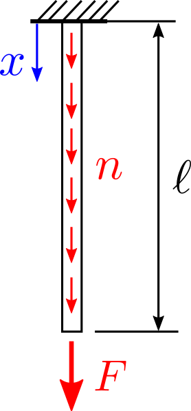
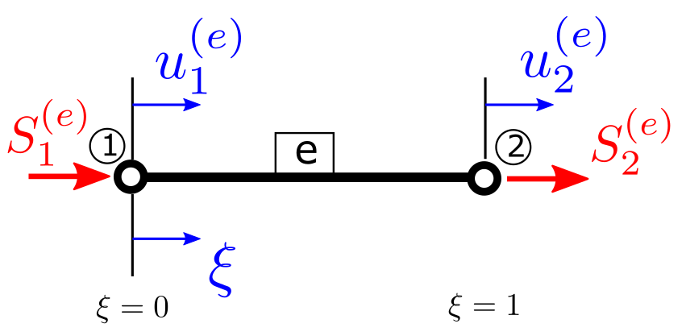
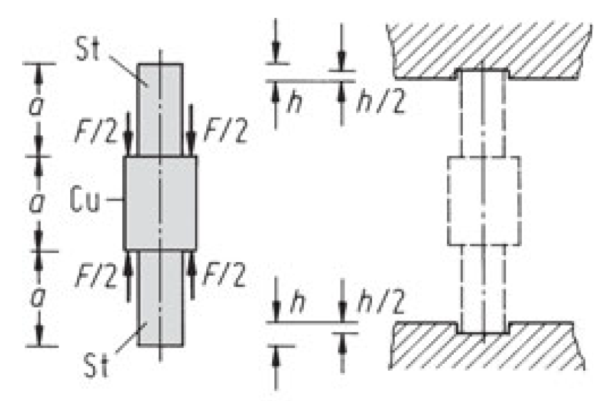
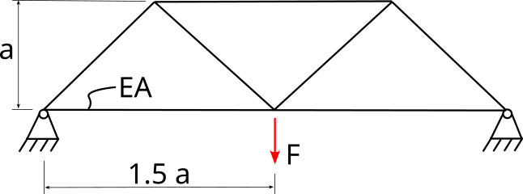

---
jupytext:
  formats: md:myst,ipynb
  text_representation:
    extension: .md
    format_name: myst
    format_version: 0.13
    jupytext_version: 1.16.7
kernelspec:
  display_name: Python 3 (ipykernel)
  language: python
  name: python3
---

```{code-cell} ipython3

```

# Der Dehnstab

In diesem Notebook wird die FEM-Implementierung für den Dehnstab erläutert und erprobt.

<div style="text-align: center;width: 400px;">
    
</div>

Die Differentialgleichung des Dehnstabes lautet:

$$
 {EA} u^{\prime \prime} =  - {n(x)} A \; ,
$$

Für diese Differentialgleichung haben wir in der Vorlesung die schwache Form hergeleitet:

$$
\textcolor{green}{\int_{0}^{\ell} \delta \epsilon\cdot E\epsilon\, A \text{ d}x } -\textcolor{red} {\int_0^{\ell} \delta u \cdot n A \text{ d}x } - \textcolor{blue}{\delta u(\ell) \cdot F} = 0\; 
$$

Ein Finites Element besteht in dem vorliegenden Beispiel aus 2 Knoten. Sowohl die Knoten, als auch die Elemente werden im Allgemeinen nummeriert, damit man sie eindeutig ansprechen kann. Im Bild sind die Elementnummern in den rechteckigen Kästen neben dem Element eingetragen. Die Knotennummer sind in den Kreisen neben den Knoten dargestellt. Die Knoten sind die Träger der primären Feldvariablen (hier: Verschiebung $u$) und Ziel der Finiten Elemente Berechnung ist die Bestimmung der primären Variablen, auch Freiheitsgrade (English: Degree of freedom **Dof**) an den Knoten. 

<div style="text-align: center;width: 400px;">
    
</div>

Auf diesen Elementen werden dann einfache Ansatzfunktionen verwendet, welche eine lineare Approximation des Verschiebungsfeldes darstellen:

$$
\begin{align}
 N_1(\xi) & = (1-\xi) \qquad N_2(\xi)= \xi  \\
 u_h(\xi) & = N_1(\xi) \hat{u}_1^{(e)}+ N_2(\xi) \hat{u}_2^{(e)} \\
 u_h(\xi) & = \sum_{I=1}^2 N_I(\xi) \hat{u}_I^{(e)}
 \end{align}
$$

```{code-cell} ipython3
import numpy as np
import plotly.graph_objects as go

# Define the x values
x = np.linspace(0, 1, 100)

N1 = 1-x
N2 = x

# Create the figure
fig = go.Figure()

# Add traces for each shape function
fig.add_trace(go.Scatter(x=x, y=N1, mode='lines', name='N_1'))
fig.add_trace(go.Scatter(x=x, y=N2, mode='lines', name='N_2'))

fig.update_layout(
    xaxis_title=r"$\xi$",
    yaxis_title=r'$N(\xi)$',
    legend=dict(x=1.05, y=1),
    font=dict(family="Serif", size=15),
    template='plotly_white',
    xaxis=dict(showgrid=True, gridcolor='grey', gridwidth=0.6, griddash='dash'),
    yaxis=dict(showgrid=True, gridcolor='grey', gridwidth=0.6, griddash='dash')
)
```

## Die Steifigkeitsmatmatrix des Dehnstabes

Im nachfolgenden Python-Code wird die Steifigkeitsmatrix des Dehnstabes berechnet:

```{code-cell} ipython3
import sympy as sp
xi,ell,E,A = sp.symbols('xi, ell,E,A')

# Formfunktionen
N1 = 1-xi
N2 = xi
N = sp.Matrix([N1,N2])

# Ableitungen der Formfunktionen
dNdxi = sp.diff(N,xi)

# Steifigkeitsmatrix
Kmat = sp.integrate(dNdxi*dNdxi.T,(xi,0,1))*E*A/ell 
Kmat
```

# Analytische Lösung der DGL des Dehnstabes

Im folgenden wird die analytische Lösung der Differentialgleichung des Dehnstabes berechnet. Dafür wird die Differentialgleichung des Dehnstabes zweimal integriert. Die Integrationskonstanten werden durch die Randbedingungen bestimmt.

```{code-cell} ipython3
E,A,x,n,F = sp.symbols('E,A,x,n,F')
u = sp.Function('u')
solution =sp.dsolve( 
          E*A*u(x).diff(x,2)+n*A,u(x) # DGL
          ,ics={ # Randbedingungen
              u(0):0, # Verschiebungsrandbedingung
              u(x).diff(x).subs({"x":ell}):F/E/A # Kraftrandbedingung
              }
          )
ufun=solution.rhs
ufun
```

Die Schnittgröße $N(x)$ erhält man dann aus:

$$
\begin{align*}
\sigma & = E \epsilon = E \frac{\partial u}{\partial x}  \\
N(x) & = \sigma A = E A \frac{\partial u}{\partial x}
\end{align*}
$$

```{code-cell} ipython3
Nfun = E*A*solution.rhs.diff(x)
Nfun
```

# FEM Implementierung des Dehnstabs

Das folgende ist nur ein Ausdruck der FEM Implementierung aus dem Python Modul `StabFEM.py` und dient nur der Veranschaulichung:

```{code-cell} ipython3
from IPython.display import display, Markdown

# Open the Python file and read its content
with open('StabFEM.py', 'r') as file:
    content = file.read()

# Display the content as Markdown
display(Markdown(f'```python\n{content}\n```'))
```

# Beispiele

+++

## Beispiel 1:

<div style="display: flex;">
    <div style="flex: 50%;">
        
    </div>
    <div style="flex: 50%;">
        <p>Gegebene Größen</p>
        <ul>
            <li>E = 210 GPa</li>
            <li>A = 33.4 cm² (I-Profil - 200 )</li>
            <li>l = 4 m </li>
            <li>F = 5 kN</li>
            <li>n = 0.1 kN/m</li>
        </ul>
        <p>Gesucht</p>
        <ul>
           <li>u(x=4m)</li>
           <li>N(x=0m)</li>
           <li>Spannung an der Stelle x=0m</li>
    </div>
</div>

```{code-cell} ipython3
from StabFEM import StabFEM
import numpy as np
import matplotlib.pyplot as plt

###############################################
# SetUp des Problems
###############################################

bsp1 = StabFEM(numnp=2,numel=1)
X = np.array([
    [0,0],
    [4000.0,0]
])
elements = np.array([
    [0,1]
])
areas = [33.4*10**2]
youngsM = [210*10**3]
loads = [0.1]

# Setzen der Knotenkoordinaten, der Elementverbindungen und der Elementdaten
bsp1.setNodalCoordinates(X)
bsp1.setElementConnectivity(elements)
bsp1.setElementData(areas,youngsM,loads)

# Setzen der Randbedingungen
bsp1.setDirichletBoundaryCondition([0,0,1],[0,1,1],[0,0,0]) # Knoten, Richtung, Wert
bsp1.setExternalForces([1],[0],[5000]) # Knoten, Richtung, Wert

# Kontrolle der Eingaben
print(f"Knotenkoordinaten:\n{bsp1.coords}")
print(f"Elementverbindungen:\n{bsp1.elements}")
print(f"Elementdaten:\n{bsp1.eData}")
```

```{code-cell} ipython3
bsp1.plotMesh()
```

```{code-cell} ipython3
###############################################
# Lösen des Problems
###############################################

# Schleife über alle Elemente, bilden der Elementmatrizen und -vektoren und assemblieren des globalen Systems
bsp1.assembleGlobalMatrix()
bsp1.assembleRightHandSide()
# Lösen des Gleichungssystems
bsp1.solveSystem()
display(r"$K_{ges}=$",(bsp1.Kges))
display("Displacement:",bsp1.dof)
display("Force:",bsp1.Fges)
```

### Darstellung der deformierten Struktur

```{code-cell} ipython3
bsp1.plotMesh(deformed = True,scale = 10)
```

### Präsentation der Ergebnisse und Vergleich mit analytischer Lösung

+++

#### Verschiebung am Ende des Balkens $u(x=\ell)$

```{code-cell} ipython3
print(f"Verschiebung am Ende des Balkens: {bsp1.getDisplacement(4000)} mm")
```

#### Schnittkraft an der Einpannung $N(x=0)$

Dies entspricht der Reaktionskraft:

```{code-cell} ipython3
print(f"Schnittkraft an der Einpannung: {-bsp1.Fges[0,0]/1000} kN")
```

## Vergleich mit analytischer Lösung

### Verschiebungsverlauf $u(x)$

```{code-cell} ipython3
XN,u =bsp1.computeDisplacement()
fig,ax = plt.subplots(1,1)

ax.plot(XN/1000,u,label="u - FEM")
ax.set_title("Verschiebungsverlauf")
ax.set_xlabel("x [m]")
ax.set_ylabel("u [mm]")
ax.grid(True)

### Analytische Lösung
subs = {
    "E":bsp1.eData[0]["youngsmodulus"],
    "A":bsp1.eData[0]["area"],
    "n":bsp1.eData[0]["lineLoad"],
    "ell":4000,
    "F":5000
}
analytic_u = sp.lambdify(x,ufun.subs(subs),"numpy")
ax.plot(XN/1000,analytic_u(XN),label="u - analytisch")
ax.legend()
```

### Normalkraftverlauf $N(x)$

```{code-cell} ipython3
XN,N =bsp1.computeNormalkraft()
fig,ax = plt.subplots(1,1)

ax.plot(XN/1000,N/1000,label="N - FEM")
ax.set_title("Normalkraftverlauf")
ax.set_xlabel("x [m]")
ax.set_ylabel("N [kN]")
ax.grid(True)

### Analytische Lösung
analytic_N = sp.lambdify(x,Nfun.subs(subs),"numpy")
ax.plot(XN/1000,analytic_N(XN)/1000,label="N - analytisch")
ax.legend()

```

```{code-cell} ipython3
errorN = (N[0]-analytic_N(0))/(analytic_N(0))
print(f"Fehler bei x=0: {errorN*100:.2f}%")
```

### Spannungsvesverlauf  $\sigma(x)$

```{code-cell} ipython3
fig,ax = plt.subplots(1,1)

area = bsp1.eData[0]["area"]

ax.plot(XN/1000,N/area,label="$\\sigma$ - FEM")
ax.set_title("Spannungsverlauf")
ax.set_xlabel("x [m]")
ax.set_ylabel("$\\sigma$ [MPa]")
ax.grid(True)

### Analytische Lösung
analytic_N = sp.lambdify(x,Nfun.subs(subs),"numpy")
ax.plot(XN/1000,analytic_N(XN)/area,label="$\\sigma$ - analytisch")
ax.legend()

```

### Aufgabe:

Versuchen Sie das Problem mit 2 und mit 3 Elementen zu lösen. Ändern Sie hierfür den obigen Quellcode ab.

+++

## Beispiel 2 - Fehleranalyse

- Wieviele Elemente benötigt man, damit der Fehler der Normalkraft kleiner als 5 % ist?
- Tragen Sie den Fehler in Abhängigkeit von der Anzahl der Elemente in einem Diagramm auf
- Welcher Zusammenhang besteht zwischen dem Fehler und der relativen Elementgröße (Elementlänge) $\frac{\ell_e}{\ell}$?

```{code-cell} ipython3
#############################################
# Hilfe
#############################################

ell = 4000 # Länge des Stabes in mm
numnp = 3  # Wieviele Knoten sollen erzeugt werden?

# Definiere die Koordinaten der beiden Randknoten
X1 = np.array([0.0,0.0]) #mm
X2 = np.array([ell,0.0]) #mm

# Generate interpolation points
t = np.linspace(0, 1, numnp)
X = X1 + t[:, np.newaxis] * (X2 - X1)
print(f"Coordinates of the nodes: \n{X}") 

# Generate Elements
IX = np.column_stack((np.arange(0, numnp-1), np.arange(1, numnp)))
print(f"Connectivity table: \n{IX}")
```

```{code-cell} ipython3

```

# Beispiel 3 - Stabsystem

Der dargestellte Verbundstab soll zwischen zwei feste
Wände geklemmt werden. Für den Einbau wird das
mittlere Stabteil mit der Kraft F zusammengedrückt.
Wie groß muss F mindestens sein, damit der Einbau
gelingt? Wie groß sind die Spannungen im Stab nach
dem Einbau? Um wieviel ist das Mittelstück nach dem
Einbau kürzer als vor dem Einbau?

<div style="display: flex;">
    <div style="flex: 50%;">
        
    </div>
    <div style="flex: 50%;">
        <p>Gegebene Größen</p>
        <ul>
            <li>E-Stahl = 210 GPa</li>
            <li>E-Cu = 105 GPa</li>
            <li>A-Stahl = 30 mm²</li>
            <li>A-Cu = 60 mm²</li>
            <li>a = 150 mm </li>
            <li>h = 3 mm </li>
        </ul>
        <p>Gesucht</p>
        <ul>
           <li>F um die Welle einzusetzen</li>
           <li>Spannungen im Stab nach dem Einbau</li>
           <li>Längenänderung des mittleren Wellenteils nach dem Einbau</li>
    </div>
</div>

+++

### Welche Kraft ist notwendig um den Stab einzubauen?

```{code-cell} ipython3
###############################################
# SetUp des Problems
###############################################

a = ???
Astahl = ???
Acu = ???
EStahl = ???
ECu = ???
h = ???

bsp3 = StabFEM(numnp=4,numel=3)
X = np.array([
???
])
elements = np.array([
???
])
areas = [Astahl,Acu,Astahl]
youngsM = [EStahl,ECu,EStahl]
loads = [0,0,0]

# Setzen der Knotenkoordinaten, der Elementverbindungen und der Elementdaten
bsp3.setNodalCoordinates(X)
bsp3.setElementConnectivity(elements)
bsp3.setElementData(areas,youngsM,loads)

# Setzen der Randbedingungen
bsp3.setDirichletBoundaryCondition(
    [???], #Knoten
    [???], #Richtung
    [???]) #Wert

# Kontrolle der Eingaben
print(f"Knotenkoordinaten:\n{bsp3.coords}")
print(f"Elementverbindungen:\n{bsp3.elements}")
print(f"Elementdaten:\n{bsp3.eData}")
```

```{code-cell} ipython3
bsp3.plotMesh()
```

```{code-cell} ipython3
###############################################
# Lösen des Problems
###############################################

# Schleife über alle Elemente, bilden der Elementmatrizen und -vektoren und assemblieren des globalen Systems

???

display("Displacement:",bsp3.dof)
display("Force:",bsp3.Fges)
print(f'Kraft die notwendig ist, das mittlere Wellenstück zusammenzudrücken: {bsp3.Fges[1,0]}')
```

```{code-cell} ipython3
bsp3.plotMesh(deformed=True,scale=10)
```

### Welche Spannung liegt nach dem Einbau vor

```{code-cell} ipython3
# Reset des Systems
bsp3.resetFEM()

# Setzen der Randbedingungen
bsp3.setDirichletBoundaryCondition(
    [???], # Knoten
    [???], # Richtung
    [???]) # Wert

###############################################
# Lösen des Problems
###############################################

# Schleife über alle Elemente, bilden der Elementmatrizen und -vektoren und assemblieren des globalen Systems

???

display("Displacement:",bsp3.dof)
display("Force:",bsp3.Fges)
```

```{code-cell} ipython3
XN,N =bsp3.computeNormalkraft()
fig,ax = plt.subplots(1,1)

ax.plot(XN/1000,N/1000,label="N - FEM")
ax.set_title("Normalkraftverlauf")
ax.set_xlabel("x [m]")
ax.set_ylabel("N [kN]")
ax.grid(True)

ax.legend()
sigstahl = ???
sigcu    = ???
print(f'Spannungen im Stahlstab: {sigstahl}')
print(f'Spannungen im Kupferstab: {sigcu}')
```

### Dehnung im mittleren Stabteil

```{code-cell} ipython3
eps = ???
print(f'Dehnung im mittleren Stab: {eps}')
```

# Beispiel 4

<div style="display: flex;">
    <div style="flex: 50%;">
        
    </div>
    <div style="flex: 50%;">
        <p>Gegebene Größen</p>
        <ul>
            <li>E-Stahl = 210 GPa</li>
            <li>A = 33.4 cm² (I-Profil - 200 )</li>
            <li>a = 5 m </li>
            <li>F = 10 kN </li>
        </ul>
        <p>Gesucht</p>
        <ul>
           <li>Verschiebung im Kraftangriffspunkt</li>
    </div>
</div>

```{code-cell} ipython3
###############################################
# SetUp des Problems
###############################################

a = 5*1000
A = 33.4*10**2
E = 210*10**3
F = -1000*10**3

X = np.array([
    ???
])
elements = np.array([
   ???
])


numnp = X.shape[0]
numel = elements.shape[0]

bsp4 = StabFEM(numnp,numel)

areas = [A for i in range(0,numel)]
youngsM = [E for i in range(0,numel)]
loads = [0 for i in range(0,numel)]

# Setzen der Knotenkoordinaten, der Elementverbindungen und der Elementdaten
bsp4.setNodalCoordinates(X)
bsp4.setElementConnectivity(elements)
bsp4.setElementData(areas,youngsM,loads)

# Setzen der Randbedingungen
bsp4.setDirichletBoundaryCondition(
    [???], # Knoten
    [???], # Richtung
    [???]) # Wert
bsp4.setExternalForces(
    [???], # Knoten
    [???], # Richtung
    [???]) # Wert
)

# Kontrolle der Eingaben
print(f"Knotenkoordinaten:\n{bsp4.coords}")
print(f"Elementverbindungen:\n{bsp4.elements}")
print(f"Elementdaten:\n{bsp4.eData}")
```

```{code-cell} ipython3
bsp4.plotMesh()
```

```{code-cell} ipython3
###############################################
# Lösen des Problems
###############################################

# Schleife über alle Elemente, bilden der Elementmatrizen und -vektoren und assemblieren des globalen Systems
bsp4.assembleGlobalMatrix()
bsp4.assembleRightHandSide()
# Lösen des Gleichungssystems
bsp4.solveSystem()
print(f'Verschiebung im Kraftangriffspunkt: { ??? } mm')
```

```{code-cell} ipython3
bsp4.plotMesh(deformed=True,scale=100)
```

```{code-cell} ipython3

```
